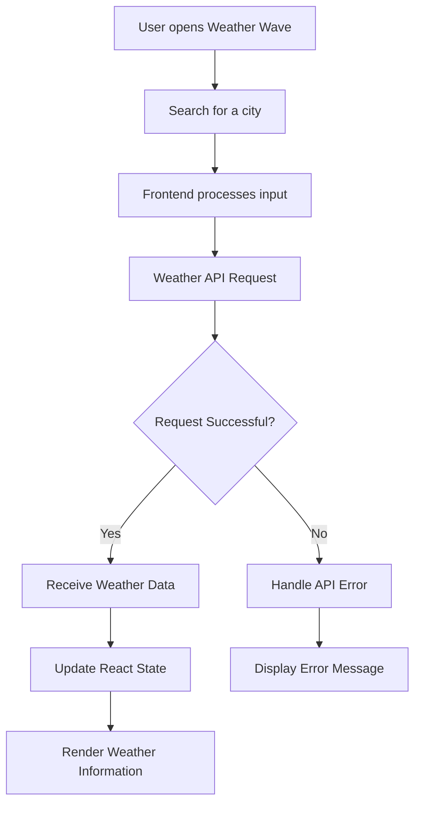
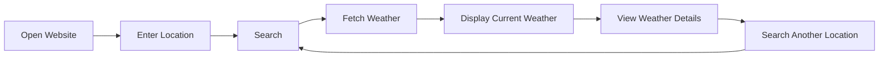
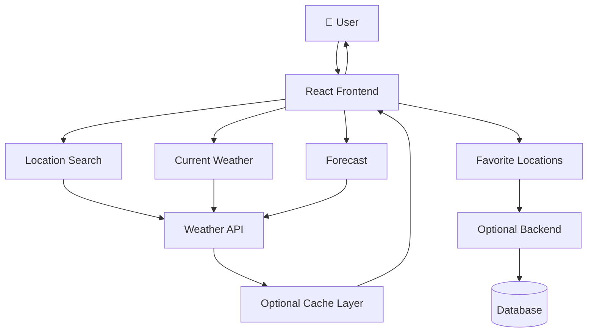

# 🌦️ Weather Wave

> **A modern, responsive weather dashboard that makes real-time weather information simple, visual, and easy to understand.**

**Live Demo:** [Weather Wave Live](https://raisarthak.github.io/WeatherWave/)

---

## 🖥️ Live Demo

### 🚀 Try Weather Wave
👉 **[https://raisarthak.github.io/WeatherWave/](https://raisarthak.github.io/WeatherWave/)**

---


## 📌 About The Project

**Weather Wave** is a modern weather dashboard designed to provide users with a clean and intuitive way to explore weather conditions.

Instead of presenting weather information as a collection of complicated numbers, the application focuses on a simple visual experience where users can search for locations and quickly understand important weather conditions.

The project was built as a practical frontend development project with an emphasis on **responsive UI, API integration, reusable components, and a smooth user experience.**

---

## ✨ Features

* 🌍 **Location-based weather search**
* 🌡️ **Current temperature information**
* ☁️ **Weather condition display**
* 💧 **Humidity information**
* 💨 **Wind information**
* 📍 **Location-aware weather experience**
* 📱 **Responsive design**
* ⚡ **Fast and interactive interface**
* 🎨 **Modern weather-focused UI**
* 🔄 **Dynamic weather data**
* ❌ **Error handling for invalid locations**
* 🌐 **Deployed and accessible online**

---


## 🛠️ Tech Stack

> Update these badges if your actual implementation uses a different stack.


### Core Technologies

| Technology       | Purpose                                 |
| ---------------- | --------------------------------------- |
| **JavaScript**   | Application logic and API interaction   |
| **CSS3**         | Styling, animations, and responsive UI  |
| **Vite**         | Development server and production build |
| **OpenWeather**  | Real-time weather and forecast data     |
| **GitHub Pages** | Live production deployment              |


---

## 🏗️ Application Architecture

The application follows a simple client-side architecture:

```text
                    ┌───────────────────┐
                    │       USER        │
                    └─────────┬─────────┘
                              │
                              ▼
                    ┌───────────────────┐
                    │   React Frontend  │
                    │                   │
                    │  Search / UI /    │
                    │  Weather Cards    │
                    └─────────┬─────────┘
                              │
                              ▼
                    ┌───────────────────┐
                    │   Weather API     │
                    │                   │
                    │ Current Weather   │
                    │ Location Data     │
                    └─────────┬─────────┘
                              │
                              ▼
                    ┌───────────────────┐
                    │   API Response    │
                    └─────────┬─────────┘
                              │
                              ▼
                    ┌───────────────────┐
                    │ React State/Data  │
                    └─────────┬─────────┘
                              │
                              ▼
                    ┌───────────────────┐
                    │   Weather UI      │
                    │                   │
                    │ 🌡️ Temperature    │
                    │ 💧 Humidity       │
                    │ 💨 Wind           │
                    │ ☁️ Condition      │
                    └───────────────────┘
```

---

## 🔄 Weather Data Flow



---

## 🔍 User Interaction Flow



---

## 📂 Project Structure

A typical structure for the project is:

```text
weather-wave/
│
├── public/
│   └── assets/
│
├── src/
│   ├── components/
│   │   ├── SearchBar
│   │   ├── WeatherCard
│   │   └── WeatherDetails
│   │
│   ├── assets/
│   │
│   ├── App.jsx
│   ├── main.jsx
│   └── index.css
│
├── .env.example
├── .gitignore
├── index.html
├── package.json
├── vite.config.js
└── README.md
```

> Replace the structure above with your exact folder structure if your project differs.

---

# 🚀 Getting Started

## Prerequisites

Make sure you have installed:

* **Node.js**
* **npm**
* **Git**

Check your versions:

```bash
node --version
npm --version
git --version
```

---

## 📥 Installation

### 1. Clone the repository

```bash
git clone https://github.com/raisarthak/WeatherWave.git
```

### 2. Navigate into the project

```bash
cd WeatherWave
```

### 3. Install dependencies

```bash
npm install
```

---

## 🔐 Environment Variables

If the application uses a weather API key, create a `.env` file in the project root.

Example:

```env
VITE_WEATHER_API_KEY=your_api_key_here
```

### Important

Never push your real API key to GitHub.

Add the environment file to `.gitignore`:

```gitignore
.env
.env.local
```

Provide an example configuration through:

```text
.env.example
```

Example:

```env
VITE_WEATHER_API_KEY=
```

---

## ▶️ Run Locally

Start the development server:

```bash
npm run dev
```

Vite will provide a local URL similar to:

```text
http://localhost:5173
```

Open that URL in your browser.

---

## 🏭 Production Build

Create a production build:

```bash
npm run build
```

Preview the production build locally:

```bash
npm run preview
```

---

# ☁️ Deployment

Weather Wave is deployed using **GitHub Pages** with automated **GitHub Actions CI/CD**.

Live Demo: **[https://raisarthak.github.io/WeatherWave/](https://raisarthak.github.io/WeatherWave/)**

Typical deployment workflow:

```text
GitHub Repository (main branch)
       │
       ▼
 GitHub Actions
       │
       ▼
 Vite Build (dist/)
       │
       ▼
GitHub Pages Deployment
       │
       ▼
https://raisarthak.github.io/WeatherWave/
```


---

# 🧠 How It Works

The application follows a straightforward process:

### 1. User enters a location

The user provides a city or location through the search interface.

### 2. Frontend sends an API request

The application sends the location to the configured weather API.

### 3. API returns weather data

The API responds with information such as:

```text
Temperature
Weather Condition
Humidity
Wind Speed
Location
```

### 4. Application processes the response

The returned information is stored/processed by the frontend.

### 5. UI updates

React re-renders the relevant components with the latest weather information.

---

# 🛡️ Error Handling

The application should gracefully handle situations such as:

* Invalid city names
* Empty search input
* API request failure
* Network connectivity problems
* Invalid API credentials
* Missing weather data
* API rate limits

A user-friendly error message should be displayed instead of exposing raw API errors.

---

# 📱 Responsive Design

Weather Wave is designed to work across different screen sizes:

```text
┌──────────────────────────────────────┐
│              Desktop                │
│                                      │
│       Weather Dashboard              │
│                                      │
└──────────────────────────────────────┘

          ↓ Responsive ↓

┌──────────────────────┐
│       Mobile         │
│                      │
│  Weather Dashboard   │
│                      │
└──────────────────────┘
```

The interface adapts to desktop, tablet, and mobile layouts.

---

# 🔮 Future Enhancements

Potential improvements for future versions:

* [ ] 🌤️ Multi-day weather forecast
* [ ] 📍 Automatic current-location detection
* [ ] ⭐ Favorite cities
* [ ] 🕐 Hourly weather forecast
* [ ] 🌅 Sunrise and sunset information
* [ ] 🌧️ Precipitation probability
* [ ] 📊 Weather charts and visual analytics
* [ ] 🌎 Multiple unit systems
* [ ] 🌓 Dark/light theme
* [ ] 📱 PWA/mobile installation support
* [ ] 🔔 Weather alerts
* [ ] 🗺️ Interactive weather map
* [ ] ⚡ API response caching

---

# 📊 Future Architecture

With additional features, the application could evolve into:



---

# 🧪 Testing Checklist

Before deploying a new version:

```text
✓ Search valid city
✓ Search invalid city
✓ Submit empty search
✓ Test API failure
✓ Test slow network
✓ Test mobile layout
✓ Test tablet layout
✓ Test desktop layout
✓ Check browser console
✓ Verify environment variables
✓ Run production build
```

---

# 👨‍💻 Author

**Sarthak Rai**

🎓 B.Tech CSE Student
💻 Full Stack Developer

### Connect With Me

* GitHub: [@raisarthak](https://github.com/raisarthak)
* LinkedIn: [Sarthak Rai](https://www.linkedin.com/in/sarthak-rai-202a9a396)
* Email: [sarthakrai610@gmail.com](mailto:sarthakrai610@gmail.com)

---

# ⭐ Show Your Support

If you found this project useful or interesting, consider giving the repository a ⭐ on GitHub.

---

<p align="center">

### 🌦️ Weather Wave

**Simple weather information. Beautifully presented.**

</p>
